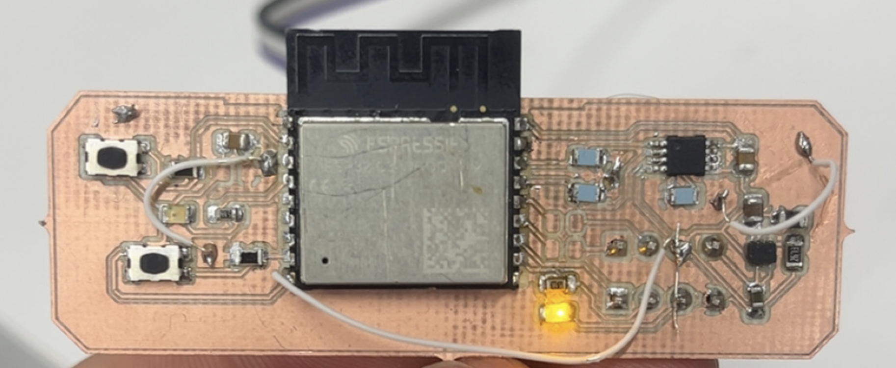

# Low-Power Temperature Sensing Node | EE153 | Fall 2025
### Made by: Jan Konings, Leah Berube, Paul Hickey
### Tufts University
### School of Engineering | Department of Electrical and Computer Engineering

This project implements a low-power, battery-powered temperature sensing node designed for long-term outdoor deployment. The system periodically measures ambient air temperature, timestamps each measurement, stores data locally, and reports measurements in batches to an MQTT server hosted on the Tufts campus network.

The goal of the project was to design a robust sensing node capable of operating for at least six months without mains power while maintaining accurate timekeeping, reliable data storage, and fault-tolerant wireless communication. The embedded firmware was written in C using ESP-IDF.

A link to the full firmware source code can be found at the bottom of this README.

## Repository Structure
- batchSends.c:
  - Main application flow, measurement scheduling, and deep sleep control
- tempSensor.c:
  - TMP1075 temperature sensor driver and I2C initialization
- RTC.c / RTC.h:
  - RTC validation and NTP time synchronization
- storage.c:
  - Non-volatile storage (NVS) for batched measurements
- transmit.c:
  - WiFi connection handling and MQTT publishing logic
- minimal_wifi.c:
  - Lightweight WiFi helper functions
- CMakeLists.txt:
  - ESP-IDF build configuration

## Hardware
- ESP32-C3 microcontroller
- TMP1075 temperature sensor
- Buck converter for efficient voltage regulation
- 3x AA lithium batteries connected in series
- Custom single-layer PCB
- Weather-resistant enclosure

## Embedded Firmware Design
### Low-Power Operation
The firmware is structured around a low-duty-cycle execution model. The ESP32 spends most of its time in deep sleep and wakes periodically to take measurements. The temperature sensor is powered through a GPIO-controlled supply so it is only active during measurement windows.

### Timekeeping and Timestamping
On each wake cycle, the firmware checks whether the RTC contains a valid timestamp. If the RTC appears uninitialized, the device connects to WiFi and synchronizes time using NTP, ensuring all measurements are timestamped accurately within the required tolerance.

### Data Storage and Batching
Each temperature measurement is stored as a timestamp–temperature pair in ESP32 non-volatile storage. Measurements persist across deep sleep cycles and resets. Once a batch reaches the predefined size, the firmware attempts to transmit the entire batch to the MQTT server.

### Wireless Communication
Temperature data is transmitted using MQTT over WiFi. Data is sent in batches to reduce WiFi overhead and power usage. Each transmission includes basic health information such as RSSI and the number of missed WiFi connection attempts.

## Deployment Strategy
- Temperature measurements are taken once per hour
- Measurements are transmitted in batches of 12 samples twice per day
- Data is retained locally during network outages
- The system is designed to operate continuously for six months or longer on battery power

